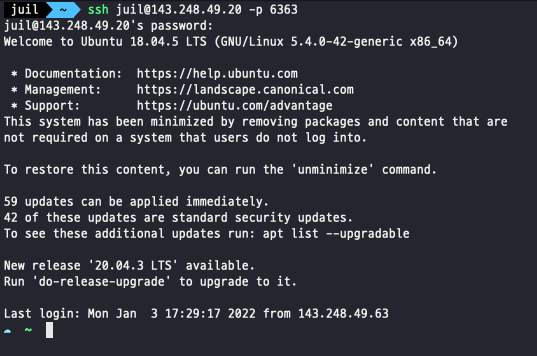

# Quick set-ups with Docker

## 1. Build a Docker image
_Dockerfile_ is just a config file containing the commands, e.g., apt-get install.

You can build an image from _Dockerfile_ by the following command:
```console
$ docker build -t docker/juil:0.1 \ 
    --build-arg USER_NAME=@YOUR_NAME \
    --build-arg PASSWORD=@YOUR_PASSWORD \
    --build-arg UID=$UID \
    --build-arg GID=$GID \ 
    .
```
_@VAR_ is for the variable that needs to be set by hand.

## 2. Create a Docker container
After building a Docker image, you can instantiate a container from that.
You can think of an image as a class and a container as an instance.

Required options look so verbose that I made a script file to execute docker run.
```console
$ sh docker_run.sh
```
__docker_run.sh:__
```sh
docker run \
    -h @HOST_NAME \ # (optional) hostname
    -it \
    --ipc=host \ # to prevent memory errors
    --restart unless-stopped \
    --gpus all \
    #--gpus '"device=0,1"' # You can assign specific gpu devices.
    -p @YOUR_PORT:22 \ # port forwarding
    --name @CONTAINER_NAME \
    -v @HOST_DIR:@CONTAINER_DIR \ # e.g. -v /home/juil/docker_home:/home/juil
    test:0.1 \ # docker image
    /bin/zsh
```
After entering the container, start ssh:
`$ sudo service ssh start`

Now you can directly access to the container:

`$ ssh YOUR_NAME@143.248.49.20 -p PORT`


